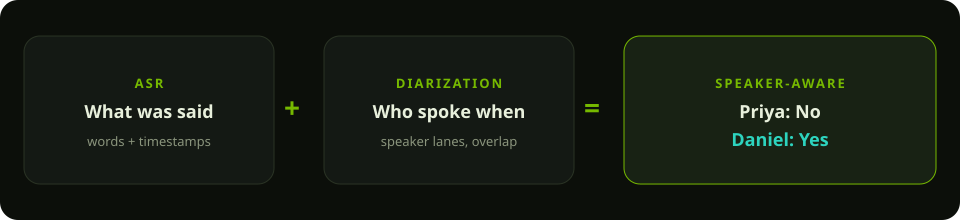
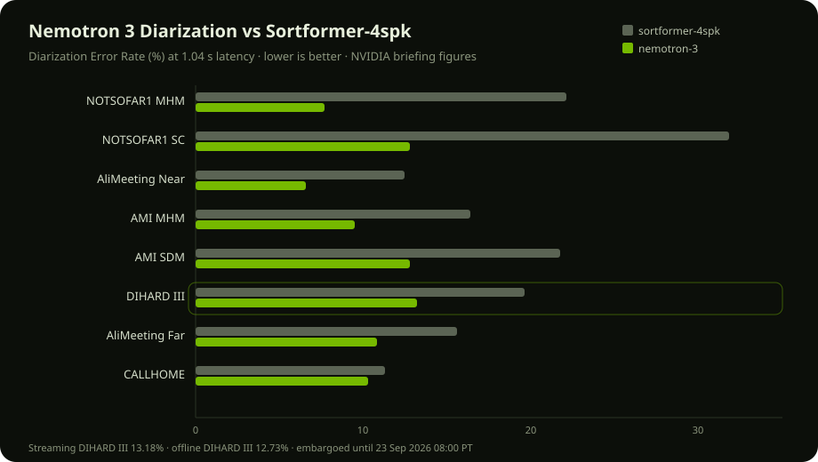
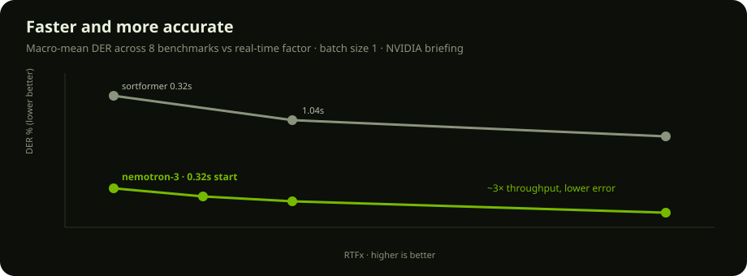
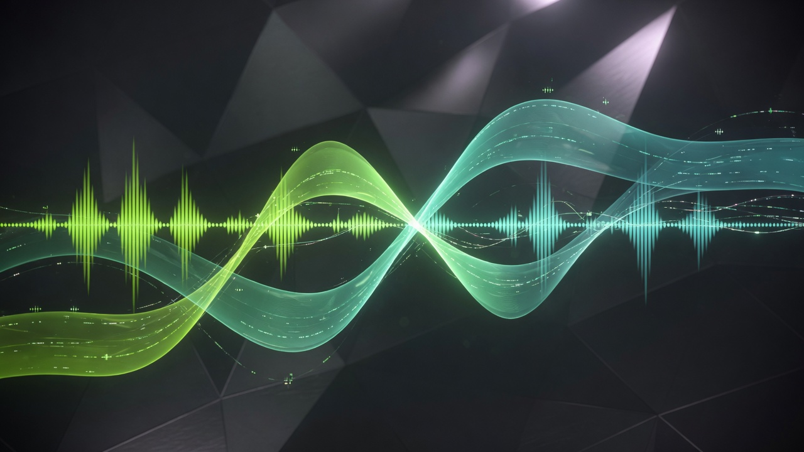

# I could download the model. Then I ran Nemotron 3 Diarization in Colab.

**3 min read** · NVIDIA Nemotron 3 Diarization preview · overlapping voices  
**Embargo:** private until 23 September 2026, 08:00 PT.

---

I could download the model.

NVIDIA put the Nemotron 3 Diarization preview on NGC Early Access — org `0767305323357365`, team `diarization-ea`, artifact `nemotron_3_diarization_preview`. The file on disk is `Nemotron-3-Diarization-preview.nemo`, 379 MB. Hugging Face has the same gated checkpoint as `nvidia/Nemotron-3-Diarization-preview`.

This laptop has **no NVIDIA GPU**. The evaluation licence wants one, and NeMo wants CUDA. So I did not run the weights here. I ran them in **Google Colab on a T4**.

## How I ran it in Colab

1. Runtime → Change runtime type → **T4 GPU**. `nvidia-smi` has to show Tesla T4 (16 GB). The model needs about **4 GB**.
2. Copy the `.nemo` to Google Drive (the Colab disk evaporates; Drive does not).
3. Open [colab.research.google.com](https://colab.research.google.com/), **File → Upload notebook**, and choose `notebooks/nemotron_3_diarization_colab.ipynb`. A `colab.research.google.com/github/…` URL 404s on this private repo.
4. Install NeMo, `restore_from` the checkpoint, call `diarize()` on a wav.
5. The last cells start **Gradio** — the same speaker-lane UI, attached to the notebook, sitting next to the GPU.

That is the whole path: NGC download → Drive → Colab T4 → Gradio. The Mac only hosts this showcase.

## What the model actually does

It does **not** transcribe. It answers **who spoke when**, including overlap, up to eight speakers, streaming or offline, language-agnostic, next to **any ASR stack**.

Same words, different speaker, different action. A blended transcript hears “No. Yes.” A diarized one hears the VP say no and the intern say yes.

NVIDIA’s briefing snapshot:

| | |
|---|---|
| Parameters | ~100M |
| Time to start | ~320 ms |
| GPU memory | 4 GB+ |
| Speakers | up to 8, with overlap |

## It is better than Sortformer, and cheaper to host

I redrew the pre-brief charts rather than pasting confidential slides.

On DIHARD III the streaming figure is **13.18% DER at 1.04 s** (offline **12.73%**). Versus Sortformer-4spk that is a large drop on meetings (NOTSOFAR, AMI) and a smaller one on CALLHOME. The throughput chart is the same story: lower error at higher RTFx.

## The lab: three voices at once

The [showcase](/) and [live lab](/lab) play a 9-second launch review with **three overlaps**. Hatched bands are simultaneous speech. Toggle the blended blob to see the agent-blind transcript.

Real inference stays in Colab. This site is Demo mode on purpose — no CUDA on this machine, and the `.nemo` is not in the git repo.

After 23 Sep 2026 the public weights should land at [`huggingface.co/nvidia/Nemotron-3-Diarization`](https://huggingface.co/nvidia/Nemotron-3-Diarization) under OpenMDW 1.1. Until then this repository stays private.
